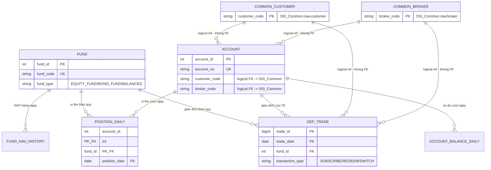

# Data Model - SSI Trading Analytics (Database/)

Tài liệu mô tả đầy đủ schema và mối quan hệ giữa các bảng trong 4 database SQL Server
(`SSI_Common`, `SSI_Equity`, `SSI_Derivatives`, `SSI_OEF`). Đây là tầng **raw/source** (OLTP,
mirror từ hệ thống nghiệp vụ, chưa qua ETL) - xem `README.md` ở gốc dự án để biết tầng transform
(dbt) xây dựng tiếp trên nền này như thế nào.

> Quy ước đọc: `PK` = primary key, `FK (same-DB)` = ràng buộc khóa ngoại thật trong cùng database,
> `FK (logical, cross-DB)` = tham chiếu logic sang database khác - **không có ràng buộc DB**, phải
> tự đảm bảo tính đúng đắn ở tầng ETL/ứng dụng vì SQL Server không hỗ trợ FOREIGN KEY liên database.

## 1. Kiến trúc tổng quan

```
┌─────────────────────┐
│     SSI_Common       │   Dung chung: to chuc, moi gioi/CTV, khach hang, phan loai, phi, tuan thu
│  (branch, department,│
│   broker, customer,  │
│   ... )               │
└──────────┬───────────┘
           │ customer_code / broker_code
           │ (tham chieu LOGIC - khong co FK that xuyen database)
   ┌───────┼────────────────┬─────────────────┐
   ▼                        ▼                 ▼
┌─────────────┐      ┌──────────────────┐  ┌─────────┐
│ SSI_Equity   │      │ SSI_Derivatives   │  │ SSI_OEF │
│ (co so)      │      │ (phai sinh)       │  │ (CCQ)   │
└─────────────┘      └──────────────────┘  └─────────┘
```

- **Vì sao tách 4 database riêng?** Mỗi sản phẩm (Cơ sở/Phái sinh/OEF) có khối lượng giao dịch lớn,
  cấu trúc dữ liệu và vòng đời vận hành khác nhau - tách biệt giúp partition/scale độc lập, và giống
  với cách các hệ thống core nghiệp vụ thật thường tách theo sản phẩm. Dữ liệu tổ chức/con
  người/khách hàng (`SSI_Common`) thì giống nhau cho cả 3 sản phẩm nên dùng chung 1 database.
- **Khóa chính của Môi giới/CTV và Khách hàng là mã string** (`broker_code`, `customer_code`),
  không phải số surrogate - vì đây vốn là tham chiếu logic xuyên 4 database, mã nghiệp vụ ổn định
  hơn số auto-increment (id số reload lại có thể lệch giữa các môi trường).
- **Mọi cột khác** (`account_id`, `security_id`, `contract_id`, `fund_id`, `trade_id`,
  `history_id`,...) vẫn là surrogate key `INT`/`BIGINT IDENTITY` như thiết kế OLTP thông thường.
- **`account_id` chỉ duy nhất TRONG PHẠM VI 1 database sản phẩm** - `SSI_Equity.account_id = 1` và
  `SSI_Derivatives.account_id = 1` là 2 tài khoản khác nhau. Không so sánh/join account_id giữa 2 DB
  sản phẩm mà không kèm theo tên database/loại sản phẩm.

---

## 2. SSI_Common

### Sơ đồ quan hệ

```mermaid
erDiagram
    BRANCH ||--o{ DEPARTMENT : "1 chi nhanh - nhieu phong ban"
    DEPARTMENT ||--o{ BROKER : "1 phong ban - nhieu MG/CTV"
    CUSTOMER ||--o{ CUSTOMER_BROKER_HISTORY : "lich su MG cham soc (SCD2)"
    BROKER ||--o{ CUSTOMER_BROKER_HISTORY : "1 MG cham soc nhieu KH theo thoi gian"
    CUSTOMER ||--o{ CUSTOMER_RISK_PROFILE : "lich su phan loai rui ro (SCD2)"
    CUSTOMER ||--o{ CUSTOMER_SEGMENT_HISTORY : "lich su phan khuc (SCD2)"
    CUSTOMER ||--|| CUSTOMER_ACQUISITION : "1 ban ghi nguon goc / KH"
    BROKER ||--o{ CUSTOMER_ACQUISITION : "MG/CTV gioi thieu (neu co)"
    CUSTOMER ||--o{ TRADING_ALERT : "canh bao lien quan"
    BROKER ||--o{ TRADING_ALERT : "canh bao lien quan"
    CUSTOMER ||--o{ CUSTOMER_COMPLAINT : "khieu nai"
    BROKER ||--o{ CUSTOMER_COMPLAINT : "khieu nai lien quan"

    BRANCH {
        int branch_id PK
        string branch_code UK
        string director_employee_code "HR - khong FK"
    }
    DEPARTMENT {
        int department_id PK
        int branch_id FK
        string head_employee_code "HR - khong FK"
    }
    BROKER {
        string broker_code PK "vd MG0001"
        int department_id FK
        string broker_type "BROKER/COLLABORATOR"
        string broker_subtype
        string employee_code "HR - khong FK"
    }
    CUSTOMER {
        string customer_code PK "vd KH00001"
        string customer_type "INDIVIDUAL/ORGANIZATION/PROPRIETARY"
        string residency "DOMESTIC/FOREIGN"
    }
    CUSTOMER_BROKER_HISTORY {
        bigint history_id PK
        string customer_code FK
        string broker_code FK
        bit is_current
    }
    CUSTOMER_RISK_PROFILE {
        bigint history_id PK
        string customer_code FK
        bit is_current
    }
    CUSTOMER_SEGMENT_HISTORY {
        bigint history_id PK
        string customer_code FK
        bit is_current
    }
    CUSTOMER_ACQUISITION {
        string customer_code PK_FK
        string referral_broker_code FK
    }
    TRADING_ALERT {
        bigint alert_id PK
        string customer_code FK
        string broker_code FK
    }
    CUSTOMER_COMPLAINT {
        bigint complaint_id PK
        string customer_code FK
        string broker_code FK
    }
```

`FEE_SCHEDULE`, `MANAGEMENT_COMMISSION_SCHEDULE`, `MARKET_INDEX_PRICE` là bảng tham chiếu độc lập
(không FK tới bảng nào) - xem chi tiết cột bên dưới.

### Chi tiết bảng

| Bảng | Cột chính | PK | FK | CHECK / ghi chú |
|---|---|---|---|---|
| `branch` | branch_code, branch_name, address, director_employee_code | branch_id | - | `director_employee_code` là mã HR, tham chiếu qua HR API, không phải FK |
| `department` | department_code, department_name, branch_id, department_type, head_employee_code | department_id | branch_id → branch | `head_employee_code` là mã HR, không phải FK |
| `broker` | broker_name, broker_type, broker_subtype, department_id, employee_code, phone, email | **broker_code** | department_id → department | `broker_type IN ('BROKER','COLLABORATOR')`; `broker_subtype` phụ thuộc `broker_type` (xem bảng phân loại bên dưới); `employee_code` bắt buộc nếu `broker_type='BROKER'` |
| `customer` | customer_name, customer_type, residency, id_number, phone, email, open_date | **customer_code** | - | `customer_type IN ('INDIVIDUAL','ORGANIZATION','PROPRIETARY')`; `residency IN ('DOMESTIC','FOREIGN')`; `PROPRIETARY` luôn `DOMESTIC`; `id_number` là dữ liệu nhạy cảm (xem mục bảo mật) |
| `customer_broker_history` | customer_code, broker_code, valid_from, valid_to, is_current | history_id | customer_code → customer; broker_code → broker | SCD2 - unique index lọc `is_current=1` (1 dòng current/khách hàng) |
| `customer_risk_profile` | customer_code, investor_classification, risk_level, valid_from/to, is_current | history_id | customer_code → customer | SCD2; `investor_classification IN ('PROFESSIONAL','NON_PROFESSIONAL')`; `risk_level IN ('LOW','MEDIUM','HIGH')` |
| `customer_segment_history` | customer_code, segment, valid_from/to, is_current | history_id | customer_code → customer | SCD2; `segment IN ('VIP','PRIORITY','RETAIL')` |
| `customer_acquisition` | acquisition_channel, referral_broker_code, acquisition_date, campaign_code | **customer_code** | customer_code → customer; referral_broker_code → broker | 1 dòng bất biến/khách hàng (không phải lịch sử) |
| `fee_schedule` | product_type, broker_tier, fee_rate, commission_rate, effective_from/to | fee_schedule_id | - | `product_type IN ('EQUITY','DERIVATIVES','OEF')` |
| `management_commission_schedule` | management_level, commission_rate, effective_from/to | schedule_id | - | `management_level IN ('HEAD_OF_DEPARTMENT','BRANCH_DIRECTOR')` |
| `market_index_price` | index_code, close_value, change_percent, volume | (index_code, price_date) | - | Benchmark dùng chung cho báo cáo Equity (VN-Index) và Derivatives (VN30) |
| `trading_alert` | alert_date, customer_code, broker_code, related_product_type/source_system/trade_id, alert_type, severity, status | alert_id | customer_code → customer; broker_code → broker | `related_trade_id` + `related_product_type` + `related_source_system` là **tham chiếu logic** sang `equity_trade`/`derivative_trade`/`oef_trade` ở 3 DB khác (khớp theo `source_system`+`source_trade_id`) - không FK |
| `customer_complaint` | customer_code, broker_code, complaint_date, channel, category, status | complaint_id | customer_code → customer; broker_code → broker | `status IN ('OPEN','IN_PROGRESS','RESOLVED','CLOSED')` |

**Phân loại `broker_subtype` theo `broker_type`:**

| broker_type | broker_subtype hợp lệ | Ý nghĩa |
|---|---|---|
| `BROKER` | `STANDARD` | Chuyên viên môi giới |
| `BROKER` | `SENIOR` | Chuyên viên môi giới cao cấp |
| `BROKER` | `TEAM_LEAD` | Trưởng nhóm |
| `BROKER` | `RM_VIP` | Chuyên viên quan hệ khách hàng VIP / wealth manager |
| `COLLABORATOR` | `REFERRAL_INDIVIDUAL` | CTV cá nhân giới thiệu |
| `COLLABORATOR` | `REFERRAL_AFFILIATE` | CTV liên kết (kênh online/KOL) |
| `COLLABORATOR` | `REFERRAL_INSTITUTIONAL` | Đối tác tổ chức |

---

## 3. SSI_Equity

### Sơ đồ quan hệ

```mermaid
erDiagram
    SECURITY ||--o{ DAILY_PRICE : "gia dong cua hang ngay"
    SECURITY ||--o{ EQUITY_TRADE : "giao dich theo ma"
    SECURITY ||--o{ POSITION_DAILY : "vi the nam giu"
    ACCOUNT ||--o{ EQUITY_TRADE : "giao dich cua TK"
    ACCOUNT ||--o{ ACCOUNT_BALANCE_DAILY : "so du cuoi ngay"
    ACCOUNT ||--o{ POSITION_DAILY : "vi the cuoi ngay"
    ACCOUNT ||--o{ MARGIN_LOAN_DAILY : "du no margin"
    COMMON_CUSTOMER ||--o{ ACCOUNT : "logical ref - khong FK"
    COMMON_BROKER ||--o{ ACCOUNT : "logical ref - khong FK"
    COMMON_CUSTOMER ||--o{ EQUITY_TRADE : "logical ref - khong FK"
    COMMON_BROKER ||--o{ EQUITY_TRADE : "logical ref - khong FK"

    SECURITY {
        int security_id PK
        string symbol UK
        string exchange "HOSE/HNX/UPCOM"
        string sector
    }
    ACCOUNT {
        int account_id PK
        string account_no UK
        string customer_code "logical FK -> SSI_Common"
        string broker_code "logical FK -> SSI_Common"
    }
    EQUITY_TRADE {
        bigint trade_id PK
        date trade_date PK
        string customer_code "logical FK -> SSI_Common"
        string broker_code "logical FK -> SSI_Common"
        int security_id FK
        string side "BUY/SELL"
    }
    ACCOUNT_BALANCE_DAILY {
        int account_id PK_FK
        date balance_date PK
    }
    POSITION_DAILY {
        int account_id PK_FK
        int security_id PK_FK
        date position_date PK
    }
    MARGIN_LOAN_DAILY {
        int account_id PK_FK
        date loan_date PK
        bit call_margin_flag
    }
    COMMON_CUSTOMER {
        string customer_code PK "SSI_Common.raw.customer"
    }
    COMMON_BROKER {
        string broker_code PK "SSI_Common.raw.broker"
    }
```

### Chi tiết bảng

| Bảng | Cột chính | PK | FK | Ghi chú |
|---|---|---|---|---|
| `security` | symbol, security_name, exchange, sector, security_type, listing_date | security_id | - | UNIQUE(symbol) |
| `daily_price` | security_id, close_price, reference_price, ceiling/floor_price, volume | (security_id, price_date) | security_id → security | Giá tham chiếu hàng ngày |
| `account` | account_no, customer_code, broker_code, open_date | account_id | **customer_code → SSI_Common.customer (logical)**; **broker_code → SSI_Common.broker (logical)** | UNIQUE(account_no) |
| `equity_trade` | trade_datetime, source_trade_id, account_no, customer_code, broker_code, security_id, market, side, quantity, price, amount, fee_amount, tax_amount | (trade_id, trade_date) | security_id → security (same-DB); customer_code/broker_code (logical, cross-DB) | `side IN ('BUY','SELL')`; UNIQUE(source_system, source_trade_id, trade_date); **partition theo tháng** trên `trade_date` |
| `account_balance_daily` | cash_balance, portfolio_value, total_asset_value | (account_id, balance_date) | account_id → account | Partition theo tháng trên `balance_date` |
| `position_daily` | quantity, avg_cost_price, market_value | (account_id, security_id, position_date) | account_id → account; security_id → security | Partition theo tháng trên `position_date` |
| `margin_loan_daily` | margin_loan_balance, margin_ratio, maintenance_margin_ratio, call_margin_flag | (account_id, loan_date) | account_id → account | Partition theo tháng trên `loan_date` |

---

## 4. SSI_Derivatives

### Sơ đồ quan hệ

```mermaid
erDiagram
    DERIVATIVE_CONTRACT ||--o{ DAILY_SETTLEMENT_PRICE : "gia thanh toan hang ngay"
    DERIVATIVE_CONTRACT ||--o{ DERIVATIVE_TRADE : "giao dich theo hop dong"
    DERIVATIVE_CONTRACT ||--o{ POSITION_DAILY : "vi the theo hop dong"
    ACCOUNT ||--o{ DERIVATIVE_TRADE : "giao dich cua TK"
    ACCOUNT ||--o{ ACCOUNT_BALANCE_DAILY : "so du cuoi ngay"
    ACCOUNT ||--o{ POSITION_DAILY : "vi the cuoi ngay"
    ACCOUNT ||--o{ MARGIN_LOAN_DAILY : "du no margin"
    COMMON_CUSTOMER ||--o{ ACCOUNT : "logical ref - khong FK"
    COMMON_BROKER ||--o{ ACCOUNT : "logical ref - khong FK"
    COMMON_CUSTOMER ||--o{ DERIVATIVE_TRADE : "logical ref - khong FK"
    COMMON_BROKER ||--o{ DERIVATIVE_TRADE : "logical ref - khong FK"

    DERIVATIVE_CONTRACT {
        int contract_id PK
        string contract_code UK "vd VN30F2701"
        string underlying_symbol
        numeric multiplier
        date maturity_date
    }
    ACCOUNT {
        int account_id PK
        string account_no UK
        string customer_code "logical FK -> SSI_Common"
        string broker_code "logical FK -> SSI_Common"
    }
    DERIVATIVE_TRADE {
        bigint trade_id PK
        date trade_date PK
        int contract_id FK
        string position_side "LONG/SHORT"
        string order_action "OPEN/CLOSE"
    }
    POSITION_DAILY {
        int account_id PK_FK
        int contract_id PK_FK
        date position_date PK
        string position_side "LONG/SHORT"
    }
    MARGIN_LOAN_DAILY {
        int account_id PK_FK
        date loan_date PK
    }
    COMMON_CUSTOMER {
        string customer_code PK "SSI_Common.raw.customer"
    }
    COMMON_BROKER {
        string broker_code PK "SSI_Common.raw.broker"
    }
```

### Chi tiết bảng

| Bảng | Cột chính | PK | FK | Ghi chú |
|---|---|---|---|---|
| `derivative_contract` | contract_code, underlying_symbol, contract_type, multiplier, listing_date, maturity_date | contract_id | - | UNIQUE(contract_code); mặc định `multiplier=100000`, `contract_type='INDEX_FUTURES'` |
| `daily_settlement_price` | contract_id, settlement_price, open_interest, volume | (contract_id, price_date) | contract_id → derivative_contract | |
| `account` | account_no, customer_code, broker_code, open_date | account_id | customer_code/broker_code (logical, cross-DB) | UNIQUE(account_no) |
| `derivative_trade` | trade_datetime, source_trade_id, account_no, customer_code, broker_code, contract_id, position_side, order_action, quantity, price, amount, margin_amount, fee_amount | (trade_id, trade_date) | contract_id → derivative_contract (same-DB); customer_code/broker_code (logical) | `position_side IN ('LONG','SHORT')`; `order_action IN ('OPEN','CLOSE')`; UNIQUE(source_system, source_trade_id, trade_date); partition theo tháng trên `trade_date` |
| `account_balance_daily` | cash_balance, portfolio_value, total_asset_value | (account_id, balance_date) | account_id → account | Partition theo tháng |
| `position_daily` | contract_id, position_side, quantity, avg_cost_price, market_value | (account_id, contract_id, position_date) | account_id → account; contract_id → derivative_contract | Partition theo tháng |
| `margin_loan_daily` | margin_loan_balance, margin_ratio, maintenance_margin_ratio, call_margin_flag | (account_id, loan_date) | account_id → account | Partition theo tháng |

---

## 5. SSI_OEF

### Sơ đồ quan hệ



**Không có `margin_loan_daily` trong `SSI_OEF`** - chứng chỉ quỹ mở không giao dịch bằng margin.

### Chi tiết bảng

| Bảng | Cột chính | PK | FK | Ghi chú |
|---|---|---|---|---|
| `fund` | fund_code, fund_name, fund_type, fund_manager, inception_date | fund_id | - | UNIQUE(fund_code) |
| `fund_nav_history` | fund_id, nav_price, total_net_asset, outstanding_units | (fund_id, nav_date) | fund_id → fund | |
| `account` | account_no, customer_code, broker_code, open_date | account_id | customer_code/broker_code (logical, cross-DB) | UNIQUE(account_no) |
| `oef_trade` | trade_datetime, source_trade_id, account_no, customer_code, broker_code, fund_id, transaction_type, quantity_unit, nav_price, amount, fee_amount | (trade_id, trade_date) | fund_id → fund (same-DB); customer_code/broker_code (logical) | `transaction_type IN ('SUBSCRIBE','REDEEM','SWITCH')`; UNIQUE(source_system, source_trade_id, trade_date); partition theo tháng |
| `account_balance_daily` | cash_balance, portfolio_value, total_asset_value | (account_id, balance_date) | account_id → account | Partition theo tháng |
| `position_daily` | fund_id, quantity_unit, avg_cost_nav, market_value | (account_id, fund_id, position_date) | account_id → account; fund_id → fund | Partition theo tháng |

---

## 6. Bảng tổng hợp quan hệ xuyên database (logical FK)

Không có ràng buộc DB nào cho các dòng dưới đây - chỉ là quy ước phải tự đảm bảo ở tầng ETL/ứng dụng:

| Từ (database.bảng.cột) | Đến (database.bảng.cột) |
|---|---|
| `SSI_Equity.account.customer_code` | `SSI_Common.customer.customer_code` |
| `SSI_Equity.account.broker_code` | `SSI_Common.broker.broker_code` |
| `SSI_Equity.equity_trade.customer_code` | `SSI_Common.customer.customer_code` |
| `SSI_Equity.equity_trade.broker_code` | `SSI_Common.broker.broker_code` |
| `SSI_Derivatives.account.customer_code` | `SSI_Common.customer.customer_code` |
| `SSI_Derivatives.account.broker_code` | `SSI_Common.broker.broker_code` |
| `SSI_Derivatives.derivative_trade.customer_code` | `SSI_Common.customer.customer_code` |
| `SSI_Derivatives.derivative_trade.broker_code` | `SSI_Common.broker.broker_code` |
| `SSI_OEF.account.customer_code` | `SSI_Common.customer.customer_code` |
| `SSI_OEF.account.broker_code` | `SSI_Common.broker.broker_code` |
| `SSI_OEF.oef_trade.customer_code` | `SSI_Common.customer.customer_code` |
| `SSI_OEF.oef_trade.broker_code` | `SSI_Common.broker.broker_code` |
| `SSI_Common.trading_alert.(related_source_system, related_trade_id)` | `equity_trade`/`derivative_trade`/`oef_trade`.(source_system, source_trade_id) tương ứng theo `related_product_type` |

Ngoài ra, `branch.director_employee_code`, `department.head_employee_code`, `broker.employee_code`
là **tham chiếu tới HR API** (`hr-api/`, ngoài phạm vi 4 database SQL Server) - không phải FK tới
bảng nào trong `Database/`.

---

## 7. Các mẫu quan hệ đáng chú ý (đọc để hiểu đúng ý nghĩa dữ liệu)

- **SCD Type 2** (`customer_broker_history`, `customer_risk_profile`, `customer_segment_history`):
  mỗi bảng giữ toàn bộ lịch sử thay đổi theo `valid_from`/`valid_to`, với đúng 1 dòng `is_current=1`
  tại mọi thời điểm (ép bằng filtered unique index). Muốn biết "khách hàng X đang do ai chăm sóc"
  → lọc `is_current=1`; muốn biết "khách hàng X do ai chăm sóc vào ngày Y" → lọc
  `valid_from <= Y AND (valid_to IS NULL OR Y <= valid_to)`.
- **`account.broker_code` vs `customer_broker_history`**: `account.broker_code` là broker gắn với
  tài khoản tại thời điểm hiện tại (do ETL cập nhật theo customer hiện tại), còn
  `customer_broker_history` mới là nguồn sự thật cho quy kết hoa hồng/AUM **theo lịch sử** - báo cáo
  cần tính đúng theo thời gian phải join `customer_broker_history` với điều kiện ngày, không dùng
  `account.broker_code`.
  - Xem `data-platform/dbt/models/marts/reports/rpt_aum_summary.sql` - ví dụ join đúng cách.
- **`equity_trade`/`derivative_trade`/`oef_trade` đều có `customer_code`/`broker_code` riêng** ghi
  trực tiếp trên từng lệnh (ai đứng lệnh tại thời điểm giao dịch) - đây là nguồn sự thật cho hoa
  hồng/doanh số theo lệnh, độc lập với `customer_broker_history`.
- **Partition theo tháng**: mọi bảng giao dịch + snapshot hàng ngày trong 3 DB sản phẩm dùng chung 1
  partition function/scheme mỗi DB (`ps_equity_monthly`, `ps_derivatives_monthly`, `ps_oef_monthly`,
  định nghĩa trong `<DB>/02_partition_helper.sql`), biên hiện phủ từ `2026-01-01` đến `2027-07-01`.
  Mở rộng thêm tháng dùng `EXEC raw.usp_add_month_partition @year=..., @month=...`.
- **Không có bảng cấp `account` dùng chung** giữa 3 DB sản phẩm - mỗi DB tự có bảng `account` riêng,
  cùng cấu trúc (customer_code, broker_code, account_no) nhưng độc lập hoàn toàn. 1 khách hàng có
  thể có tối đa 3 account_id khác nhau (1 ở mỗi DB) nếu dùng cả 3 sản phẩm.

## Xem thêm

- `README.md` (gốc dự án) - tổng quan toàn dự án, pipeline ELT, danh sách 13 báo cáo.
- `Database/run_all.sql` - thứ tự chạy đầy đủ 4 database.
- `data-platform/dbt/models/marts/dim/` - các bảng dimension dbt dựng trên nền schema này (đã gộp
  logic tra cứu HR, SCD2 hiện tại, và hợp nhất account across 3 DB qua `dim_account.sql`).
